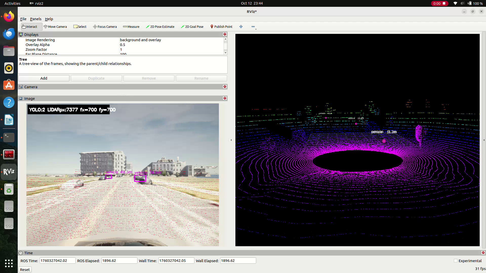

# Multi-Sensor 3D Object Localization (UDrive)

A ROS 2 perception stack that fuses camera and LiDAR to detect objects and recover their
3D positions, then projects those positions into global GPS coordinates using GNSS.



**Stack:** ROS 2 Humble · Python · YOLOv8 · OpenCV · PCL

---

## Results

| Metric | Value |
|---|---|
| Localization error vs GNSS | < 0.5 m |
| Perception stack rate | 10 Hz |
| Field validation runs | 12 |

*(Numbers pulled from field testing — see project report for methodology.)*

## How it works

```
Camera image ──► YOLOv8 detection ──► 2D bounding boxes
                                            │
LiDAR scan ──► point cloud ────────────────┤
                                            ▼
                              camera–LiDAR fusion (extrinsic
                              calibration + projection)
                                            │
                                            ▼
                            3D object position (local frame)
                                            │
                              GNSS pose ────┤
                                            ▼
                              Global GPS coordinates
```

### Nodes

- **`yolo_detector_node.py`** — runs YOLOv8 on the camera stream, publishes 2D detections.
- **`yolo_lidar_fusion_node.py`** — projects LiDAR points into the camera frame using the
  calibrated extrinsics, associates points with 2D detection boxes, and transforms the
  resulting 3D object poses into the global frame using GNSS.
- **`objects_printer_node.py`** — subscribes to the fused output for debugging/logging.

*(An earlier `lidar_camera_fusion_node.py` split the camera–LiDAR projection into its own
node; that logic was later consolidated into `yolo_lidar_fusion_node.py`.)*

### Launch files

- `full_fusion.launch.py` — full pipeline, hardcoded parameters.
- `full_fusion_yaml.launch.py` — same pipeline, parameters loaded from YAML.
- `full_fusion_print.launch.py` — full pipeline with the debug printer node attached.

## Running it

```bash
git clone https://github.com/nithinkumaraitha/multisensor-3d-localization.git
cd multisensor-3d-localization
colcon build --symlink-install
source install/setup.bash
ros2 launch u_drive_perception full_fusion.launch.py
```

Requires a calibrated camera–LiDAR extrinsic transform and a GNSS source publishing to the
expected topic (see launch file parameters).

## What I'd do differently

- Move the camera–LiDAR extrinsic calibration into a config file rather than hardcoding it
  in the fusion node — makes the package portable to a different sensor rig.
- Add unit tests around the projection math; right now correctness was verified only by
  field comparison against GNSS ground truth, not automated tests.
- The current pipeline assumes a single detection class mapping cleanly to one LiDAR
  cluster; multi-object occlusion cases weren't handled explicitly.

## License

MIT
